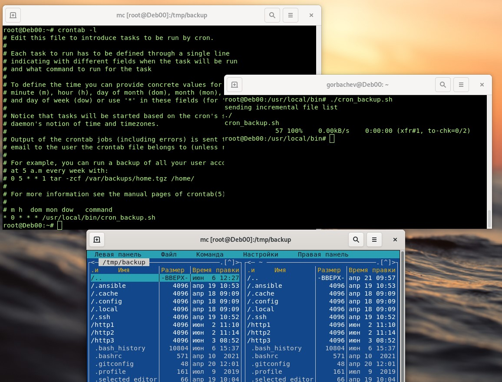

# Домашнее задание к занятию 3 «Резервное копирование» - `Горбачев Олег`

### Цель задания
В результате выполнения этого задания вы научитесь:
1. Настраивать регулярные задачи на резервное копирование (полная зеркальная копия)
2. Настраивать инкрементное резервное копирование с помощью rsync
------

### Чеклист готовности к домашнему заданию

1. Установлена операционная система Ubuntu на виртуальную машину и имеется доступ к терминалу
2. Сделан клон этой виртуальной машины с другим IP адресом
------

### Полезная информация
*Перед тем как приступить к решению, выполнить следующие действия, для упрощения решения поставленных задач*
*выполняем команду в архивном режиме
```shell
rsync -a --progress . /tmp/backup
```
*смотрим что получилось*
```shell
ll /tmp/backup
```
*удалим директорию синхронизации*
```shell
rm -rf /tmp/backup
```
*исключаем из синхронизации файлы с именем file*
```shell
rsync -a --exclude '*file*' . /tmp/backup
```
*смотрим что получилось*
```shell
ll /tmp/backup | grep file
```
```shell
ll /home/root | grep file
```
*создаем новый файл*
```shell
touch test
```
*произведем синхронизацию*
```shell
rsync -a --progress . /tmp/backup
```
*удаляем файл test*
```shell
rm -rf test
```
*произведем синхронизацию*
```shell
rsync -a --progress . /tmp/backup
```
*смотрим что получилось*
```shell
ll /tmp/backup | grep test
```

*делаем заркальную  полную копию*
```shell
rsync -a --progress --delete . /tmp/backup
```
*копируем на удалённый сервер*
```shell
rsync -a --progress .bash_history root@10.0.2.15:/tmp
```
*настройка синхронизации по ssh*
```shell
ssh-keygen -t rsa
```
```shell
ssh-copy-id root@10.0.2.15
```
------
### Задание 1
- Составьте команду rsync, которая позволяет создавать зеркальную копию домашней директории пользователя в директорию `/tmp/backup`
- Необходимо исключить из синхронизации все директории, начинающиеся с точки (скрытые)
- Необходимо сделать так, чтобы rsync подсчитывал хэш-суммы для всех файлов, даже если их время модификации и размер идентичны в источнике и приемнике.
- На проверку направить скриншот с командой и результатом ее выполнения
### Решение 1
*устанавливаем rsync*
```shell
apt-get install rsync
```
```shell
systemctl enable rsync
```
```shell
systemctl start rsync
```
*создаём зеркальную копию домашней дириктории*
```shell
rsync -a --progress --delete . /tmp/backup
```
*исключаем из синхронизации скрытые файлы*
```shell
rsync -a --exclude '.*' . /tmp/backup
```
*проверяем хэш-сумму используя параметр "-с"*
```shell
rsync -ac --progress --delete . /tmp/backup
```


---
### Задание 2
- Написать скрипт и настроить задачу на регулярное резервное копирование домашней директории пользователя с помощью rsync и cron.
- Резервная копия должна быть полностью зеркальной
- Резервная копия должна создаваться раз в день, в системном логе должна появляться запись об успешном или неуспешном выполнении операции
- Резервная копия размещается локально, в директории `/tmp/backup`
- На проверку направить файл crontab и скриншот с результатом работы утилиты.

### Решение 2
*создаём скрипт*
```shell
nano /usr/local/bin/cron_backup.sh
```
```shell
#!/bin/bash

rsync -a --progress --delete . /tmp/backup
```
*делаем его исполняемым*
```shell
chmod +x /usr/local/bin/cron_backup.sh
```
*добавляем файл в cron*
```shell
crontab -e
```
*добавляем команду для выполнения по расписанию*
```shell
* 0 * * * /usr/local/bin/cron_backup.sh
```
*файл cron и резултаты проверки*

---
